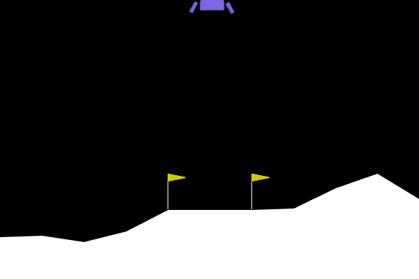

# RL MoonLander DQN

Deep Q-Network (DQN) implementation for `LunarLander-v3` using Gymnasium and PyTorch.

## What this repo contains

- Canonical package code under `src/moonlander_rl/`
- DQN training and evaluation entry points under `src/moonlander_rl/dqn/`
- Shared environment utilities under `src/moonlander_rl/env/`
- Tests under `tests/`
- Optional notebook workflow under `notebooks/`

Training and evaluation artifacts are written to `results/`.

## Demo



## Environment details

This project targets the discrete Lunar Lander task:

- **Env ID**: `LunarLander-v3`
- **Observation space**: 8D state vector
- **Action space**: `Discrete(4)` (noop, left, main, right engine)
- **Typical solved threshold**: average return >= 200 over 100 episodes

## Project layout

```text
RL_DQN_Moonlander/
├── README.md
├── Makefile
├── requirements.txt
├── notebooks/
├── src/
│   └── moonlander_rl/
│       ├── dqn/
│       │   ├── main.py          # training CLI
│       │   ├── eval.py          # evaluation + watch/GIF CLI
│       │   ├── agent.py
│       │   ├── train.py
│       │   └── ...
│       └── env/
│           └── utils.py         # make_env, seeding, logging
└── tests/
    ├── dqn/
    └── test_env.py
```

## Installation

Use Python 3.10+.

```bash
python -m pip install -r requirements.txt
python -m pip install -e .
```

If you use conda:

```bash
conda activate torch310
```

## Quick start

### Train

```bash
python -m moonlander_rl.dqn.main
```

or via console script:

```bash
dqn-train
```

### Evaluate

```bash
python -m moonlander_rl.dqn.eval --episodes 100
```

or:

```bash
dqn-eval --episodes 100
```

### Watch one greedy episode live

```bash
python -m moonlander_rl.dqn.eval --watch
```

### Save one greedy episode as GIF

```bash
python -m moonlander_rl.dqn.eval --gif results/dqn/eval_episode.gif
```

## Make targets

`Makefile` provides a convenient workflow:

- `make install` / `make install-dev`: install dependencies + editable package
- `make train`: run DQN training
- `make eval`: greedy evaluation
- `make eval-watch`: evaluation + one live episode
- `make eval-gif`: evaluation + one GIF episode
- `make test`: run all tests
- `make lint`: run Ruff checks
- `make format`: format code with Ruff
- `make check` / `make ci`: lint + tests

## Logging and outputs

The shared `RunLogger` writes:

- CSV logs to `results/logs/`
- TensorBoard logs to `results/tensorboard/`

DQN checkpoints/plots are saved under `results/dqn/`.

Launch TensorBoard:

```bash
tensorboard --logdir results/tensorboard
```

Then open [http://localhost:6006](http://localhost:6006).

## Testing

Run everything:

```bash
python -m pytest
```

Run only environment sanity test:

```bash
python -m pytest tests/test_env.py
```

## Notes

- Seeding and env creation are centralized in `moonlander_rl.env.utils`.
- Evaluation supports extra options like `--checkpoint`, `--max-steps`, `--device`,
  `--demo-trials`, and `--vis-seed`.
